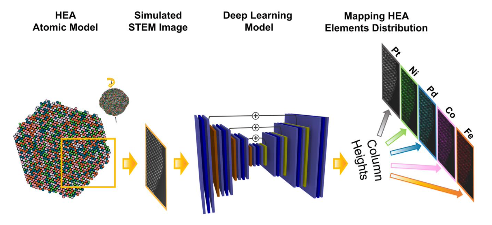

# Deep-Learning-High-Entropy-Alloys
High Entropy Alloys (HEAs) are multi-chemical elements alloys with exceptional physical properties. HEAs have sparked the interest in engineering applications such as energy storage, catalysis and bio/plasmonic imaging. The understanding of the structural of composition of HEAs is paramount for the appropriate tuning of their properties. Scanning Transmission Electron Microscopy (STEM) is typically used to acquire images of various materials at the atomic scale resolution. including HEAs. In this repository it is demonstrated how computer vision analysis based on Deep Learning (DL) could be used to extract structural information from STEM images of HEAs. In particular a Fully Convolutional Neural Network (FCN) is trained to recognize the number of atoms of different chemical species in the atomic columns of HEA (i.e., column heights CHs) through semantic segmentation of simulated and experimental STEM images. As a benchmark case, equiatomic PtNiPdCoFe HEAs are considered. This project represent a first attempt for the identification of chemical species in 3D materials. Thus, in addition to the estimation of the structural properties of HEAs, this work establish an advancement of DL applied to microscopy image which could be useful for a broad area of nano-science applications.

